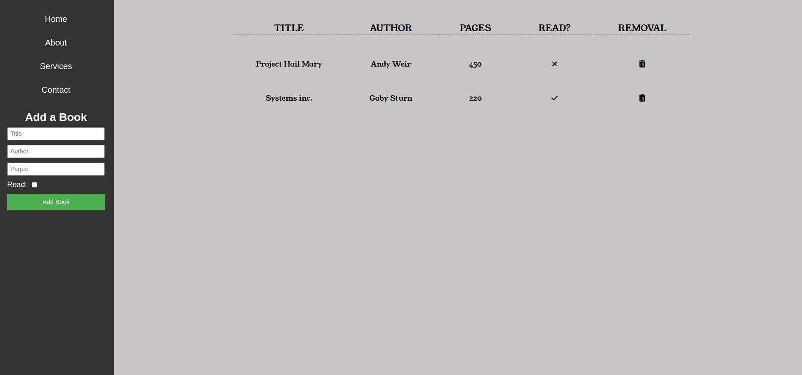

# bookapp

<h1 align="center">Admin-Dashboard-First</h1>

 
    Library book app built with JavaScript, SASS, HTML.
    

## Live Preview

[Live Preview](https://doubzero.github.io/bookapp/)

## Short Description

This app is a user-friendly library management tool that allows users to catalog and organize their book collection. Users can add books by entering details such as title, author, and number of pages through a simple form, and these books are displayed in a table format on the webpage. Users can further interact with their library by toggling the reading status of each book and removing unwanted entries with intuitive icons.

## Tech Used

- JavaScript
- SASS
- CSS
- Git
